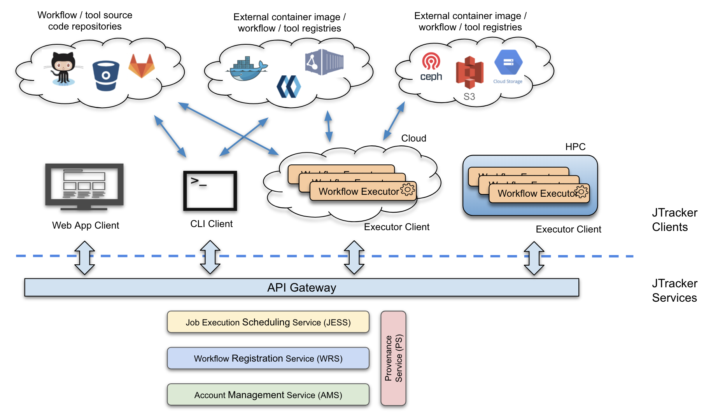

# JTracker Workflow System

## Introduction

In the data-driven discovery age of genomics, enormous amounts of data present us
with both unique opportunities and unprecedented challenges. The demand for easy to
use and highly automated workflow management and execution is increasely high. In
the current state of the scientific workflow space there are many solutions but 
still has large room for improvements, such as scalability, more automation,
component sharing and reuse, better data provenance tracking etc.

## Design Objectives

* Multi-tenancy support natively, JTracker provides a platform for collaboration.
  This curial for big consortium projects with large and complex computational tasks.
* Cloud friendly and horizontally scalable. Scaling up by simply adding more servers
  and workers.
* Complete solution: support workflow full lifecycle including authoring/revising,
  testing, registration, sharing, execution, provenance recording, and publication
  of analysis results and associated metadata allowing reproducibility.
* A generic platform for workflow management / execution.
  * Workflows can be written in different workflow languages.
  * Even possible to compose a workflow by putting together tools/workflows written
    in different workflow languages.
* Decouple job/task scheduling and execution.
  * Server is completely compute environment agnostic.
  * Computation and data access can take place via workflow executors at various
    cloud platforms or HPC clusters.
  * Users take control on where to execute workflow jobs.
  * Server does not need to access potentially sensitive data/credentials used in
    workflow steps.
* Support full provenance and reproducibility.
  * Recording provenance out of box, no action needed from users.
  * Detailed provenance allows full reproducibility of any data product.
  * Every entity is assigned with an immutable UUID can be used in scientific
    publication as permanent reference.
* Leverage public resources as much as possible. For example, public dockerized tool
  registries such as Dockstore, bio.tools, BioShaDock; public Git repositories such as
  GitHub and Bitbucket for workflow source code management; public container image
  registries such as DockerHub and Quey.
* Support applicable GA4GH standards and contribute to developing GA4GH standards
  as well.

## Architectural Design and System Components

As depicted in the following diagram, JTracker is architected as a client-server
application. Server side provides various types of services delivered via REST API
endpoints. Different types of clients interact with the JTracker server
to performance certain operations, such as searching for workflows, registering
workflows, submitting jobs and launching executors etc.

Following service-oriented architecture design, JTracker server consists of four
self-contained and loosely coupled modules. Each module provides a particular
service scoped around one type of activity. Clean separation and narrow scope
keeps each module simple, being able to be implemented and maintained independently.
This design also allows each service to scale up or down according to workload.
Briefly, here are the four services:

* Account Management Service (AMS): As a multi-tenancy system, AMS manages account
  for users and organizations. We model the account management similar to GitHub.
* Workflow Registration Service (WRS): A few different types of tool or workflow
  can be registered in JTracker, these include tools already registered in Dockstore,
  workflows defined using CWL, WDL or JTracker with source code checked in public Git
  repository. Registered workflow will be assigned with an immutable UUID. WRS
  supports semantic versioning to manage workflow releases.
* Job Execution Scheduling Service (JESS): This service orchestrates workflow job
  execution. Typically, via JTracker CLI tool, user creates job queue for a chosen
  workflow and then submit jobs to the queue. Next, the user will launch JTracker
  Executor to fetch queued jobs for execution. JESS ensures jobs and their sub-tasks
  are assigned to executors properly taking into account of task dependencies, data
  locality and other compute resources.
* Provenance Service (PS): PS serves as a logger records all activities in JTracker
  in an append only fashion.

Powered by JTracker services, three different clients are built to perform various
operations:
* Web-based application provides easy to use graphic interface to access most of the
  JTracker functionalities. This greatly reduces the barrier for users to take
  advantage of the powerful workflow system.
* Command line interface (CLI) client is more suitable for developers and bioinformaticians
  to perform routine operations such as authoring/testing new workflows, submitting jobs
  in big batches. The CLI client can be easily incorporated into user’s automated processes.
* JTracker Executor client is the workhorse launched in different compute environment
  that pulls task from JTracker JESS service and performs the actual computation.

